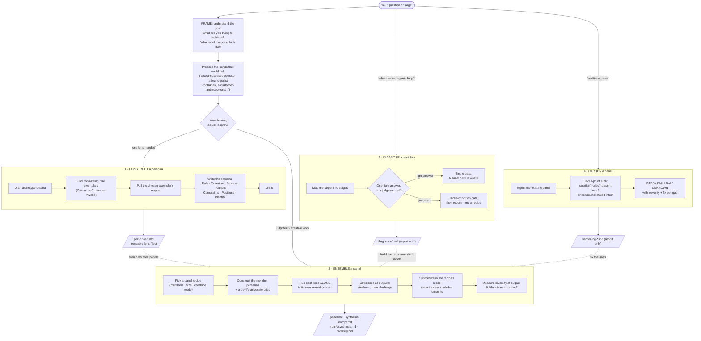

# agent-studio

**Build AI agent personas. Assemble them into panels of genuinely different viewpoints. Combine what they say without averaging it into mush.**

agent-studio is a [Claude Code](https://claude.com/claude-code) skill for viewpoint diversity, and it works as a dialogue: it starts by understanding the goal you are trying to achieve, proposes the kind of mind (or panel of minds) that would actually help, discusses that direction with you, and only then builds. It constructs opinionated agent personas (stances, expertise, positions, identities), runs them as isolated ensembles on a question, and synthesizes their outputs while keeping the disagreements visible. It can also analyze an existing workflow and tell you where agents would help, and where they would be a waste of money.

Every design rule in it comes from a research pass over the academic and practitioner literature on persona prompting, multi-agent ensembles, and perspective synthesis. The short version of that evidence:

- Personas change what a model concludes, not just its tone, and a single prompt style quietly homogenizes output.
- Ensembles collapse toward consensus on their own, and more capable models conform more, so anti-conformity has to be engineered in.
- Naive blending of diverse outputs flattens them back to the average; how you combine is a first-order design lever.
- Panels only pay for themselves on judgment work. On tasks with one right answer, debate loses to a single strong pass at higher cost.

## What it does



The mental model: **construct makes the people, ensemble makes the meeting.** Personas are standalone files you can reuse solo or in any panel; a panel is just an arrangement of them. Diagnose and harden are read-only analysis modes that emit reports and never touch the target.

## How you use it

Talk to it. In Claude Code, with the skill installed:

```
/agent-studio build me a creative-direction panel for this brand concept
/agent-studio construct a persona: a fashion designer lens, ground it in a real person
/agent-studio get 5 perspectives on whether we should enter this market, and synthesize
/agent-studio diagnose ~/my-skills/deep-research: where would agents actually help?
/agent-studio harden this panel   (with a panel.md in your project)
```

A typical panel run, end to end:

1. **Frame.** A dialogue, not a form. It first restates the goal as it understands it (what you are trying to achieve, what success looks like, what kind of help that calls for), asking a clarifying question or two if the goal is fuzzy. Then it proposes the minds that would help and why: a one-line personality sketch per suggested member, plus the panel shape from the recipe table. You discuss, swap members, adjust stances, or approve; nothing gets built until the direction is agreed.
2. **Construct.** It writes each member persona. For grounded personas it searches for deliberately contrasting real people who embody the archetype differently, and can pull their actual writing as a corpus. Named-person personas are always labeled as interpretations.
3. **Run.** Each lens answers **alone, in a sealed context**. No lens sees another before combining. That isolation is what buys real diversity; the critic runs after and is the one agent that sees everything.
4. **Synthesize.** The default output is a dissent-carrying synthesis: where the lenses agree, where they clash, what only one of them saw, and which dissent must survive into the decision. Vote, selection, and set-preserving modes exist for recipes that call for them. Nothing is ever averaged into consensus.
5. **Measure.** A diversity score runs at generation and at output. If the synthesis quietly dropped the outlier view, that shows up as a flag, not a vibe.

By default the skill **generates artifacts and stops** (personas + panel plan + a paste-ready synthesis prompt). Say "run it" and it executes the panel too.

### Two rulebooks, switched by mode

The guardrails change with the kind of work, on purpose:

| | Judgment work (facts, evaluation, decisions) | Creative work (ideation, direction, options) |
|---|---|---|
| Persona bias | Contamination. Strict rules, stereotype probe. | Pigment. Strong, exaggerated lenses encouraged. |
| Opinions | Grounded in real, citable stances. | Authored for flavor. |
| Failure check | Stereotype injection. | Cliche collapse (lazy archetypes flatten into one voice). |
| Who decides | The synthesis surfaces the answer space. | **The human picks.** The skill never selects the winner. |

## Artifacts

Everything lands in `agent-studio-out/` in your working directory:

```
agent-studio-out/
  personas/<name>.md        reusable persona files (Five-Element template)
  panel.md                  the panel plan: members, size, topology, combine mode
  synthesis-prompt.md       paste-ready combine prompt for the recipe's mode
  run-<timestamp>/          when you ask it to run:
    <lens>.md               each lens's isolated answer
    synthesis.md            the combined output, dissents labeled
    diversity.md            generation-stage and output-stage diversity
  diagnosis-<slug>.md       diagnose reports
  hardening-<slug>.md       harden reports
```

## Install

```bash
git clone https://github.com/nraford7/agent-studio.git
cp -R agent-studio ~/.claude/skills/agent-studio     # or your skills directory
```

Then invoke with `/agent-studio` or just ask to build a persona or a panel.

### Optional environment keys (it degrades gracefully without them)

- `EXA_API_KEY` enables exemplar search (finding real contrasting people). Without it, supply exemplars yourself.
- `OPENAI_API_KEY` enables semantic diversity scoring. Without it, a lexical fallback runs and labels itself degraded.

No network library is required: pages are fetched with `curl`. WebFetch is never used.

## Scripts

Two small Python helpers do the parts a model can't do reliably in-prompt:

- `scripts/exemplar_find.py find --archetype "fashion designer"` searches for exemplar leads (titles + URLs, de-duplicated) which the skill resolves into named people. `corpus` pulls a chosen person's pages as stripped text.
- `scripts/diversity.py FILE1 FILE2 [...]` computes mean pairwise semantic distance with per-pair detail, used to catch a synthesis that flattened its panel.

```bash
python3 -m pytest -q     # 12 tests
```

## Design rules the skill enforces (the short list)

1. **One isolated subagent per lens.** Never persona-swaps in one shared context; that is the maximally colluding anti-pattern.
2. **A critic beats an extra generator.** Every judgment panel gets a devil's-advocate that steelmans before it attacks.
3. **Never naive-mean-blend.** Combine in the recipe's mode; dissent-carrying is the default; de-duplicate before combining.
4. **Quality AND coverage, never one scalar.** A panel result that reports a single score is hiding its flattening.
5. **Personas are stances, not job titles.** Identity through a name, a short backstory, one contradiction. Demographics off by default. Cap ~1000 words.
6. **Reused personas drift.** Re-anchor by re-injecting the persona file; never reset the conversation.

## Why give agents personalities? The research

This skill exists because of a specific, evidence-backed claim: **a persona is not decoration, it is targeting.** The full research corpus behind it (three fact-checked research bibles, a distilled playbook, and an external-sources digest, about 24,000 words with full bibliographies) is included in [`docs/research/`](docs/research/). The argument in brief:

**1. A personality steers where the model thinks from.** During pretraining a language model learns to simulate an enormous repertoire of characters, because predicting human text requires modeling whoever wrote it. Anthropic's Persona Selection Model describes the assistant you normally talk to as one selected character from that repertoire, and mechanistic work (persona vectors, the "Assistant Axis") shows these characters exist as steerable directions in the model's activations. A well-written persona conditions the model into a different region of that space. You are not asking the model to pretend; you are choosing which of its learned characters does the reasoning.

**2. Personas change conclusions, not just tone.** Across 162 personas, 7 models, and roughly 90 million generations, the gap between the best and worst persona on the same task reached 38.56 percentage points, and even a single pronoun swap changed which problems a model solved. Personality is a substantive lever on output, which cuts both ways: it is why personas are worth building carefully, and why careless ones inject bias.

**3. The default assistant voice quietly makes everything the same.** The landmark finding for creative work: generative AI raises individual output quality while shrinking collective diversity, because everyone is drawing from the same default character. Structured, distinct personas are the documented countermeasure; they preserve the spread of ideas that a single voice collapses. For ideation, creative direction, and strategy, that spread is the product.

**4. A panel of personas beats one model only under conditions, and those conditions are engineerable.** Ensembles of agents drift into consensus even with no incentive to agree, and more capable models conform more, not less. What recovers the value: genuinely heterogeneous members (different stances and values, not one voice in costumes), strict isolation while generating, a dedicated devil's-advocate, and a combine step that preserves disagreement. Panels pay off on judgment and creative work; on tasks with one right answer they lose to a single strong pass at higher cost.

**5. The combine step is where diversity goes to die.** Naive blending drags a diverse set of views back to their average and discards the standout. Judge-based selection cannot exceed the best single candidate. The evidence-backed alternative is dissent-carrying synthesis, the judicial model: a majority opinion published together with its dissents, so the decision-maker sees the live disagreement instead of a manufactured consensus.

**6. What actually makes a persona work:** a functional stance (what it optimizes for, under what pressure) beats a job title; identity lands through implicit cues (a name, a short backstory, one contradiction) rather than demographic labels, which mostly inject stereotypes; substantive positions matter for value-laden work and must be grounded in real stances for judgment tasks; and personas drift over long conversations, softening back toward the default assistant, so reused personas need re-anchoring.

**Confidence, honestly labeled.** The corpus marks every claim by evidence strength. Solid and multi-study: personas change substance; single-voice homogenization; consensus collapse; blending flattens; isolation and critics help. Thinner: which construction axis (stance vs role vs values vs named exemplar) drives diversity best, where no head-to-head study exists. And the stance-diverse panel at the center of this skill is an evidence-grounded design bet, not a directly measured result. The most valuable experiment you can run with this skill is exactly that missing head-to-head.

### The research corpus

| Document | What it covers |
|---|---|
| [Persona-Ensembles-Research-Bible.md](docs/research/Persona-Ensembles-Research-Bible.md) | The main question: do persona ensembles produce real reasoning diversity and better judgment? Includes the creative/subjective/taste deep-dive (Section 7). |
| [Persona-Construction-Research-Bible.md](docs/research/Persona-Construction-Research-Bible.md) | How to build an effective persona; which construction axes carry the signal; the fidelity gap; failure modes. |
| [Perspective-Synthesis-Research-Bible.md](docs/research/Perspective-Synthesis-Research-Bible.md) | How to combine diverse perspectives without flattening them; mixture-of-agents evidence; the selection bottleneck. |
| [Persona-Construction-Playbook.md](docs/research/Persona-Construction-Playbook.md) | The one-page distillation the skill implements, every rule tagged by confidence. |
| [Persona-External-Sources-Digest.md](docs/research/Persona-External-Sources-Digest.md) | Reconciled external sources: Anthropic's Persona Selection Model, the persona-drift literature, practitioner frameworks. |

Each bible was produced by a retrieval-first research pipeline (evidence gate, question-driven deepening, mechanical citation verification) and then attacked by an independent adversary model whose refutations were folded back in; press-sourced and unverified claims are flagged inline.

## Provenance

Beyond the research corpus above, the build itself is documented: design specs, implementation plans, and run ledgers for all three build cycles live in `docs/superpowers/`. The skill was reviewed twice independently (a Claude start-to-finish review and a fresheyes/codex review) and the reconciled findings were applied in a fix cycle.

Honest limits: persona QC is structural linting, not behavioral testing; and the diagnose/harden reports are judgment aids, not proofs.

## License

MIT
